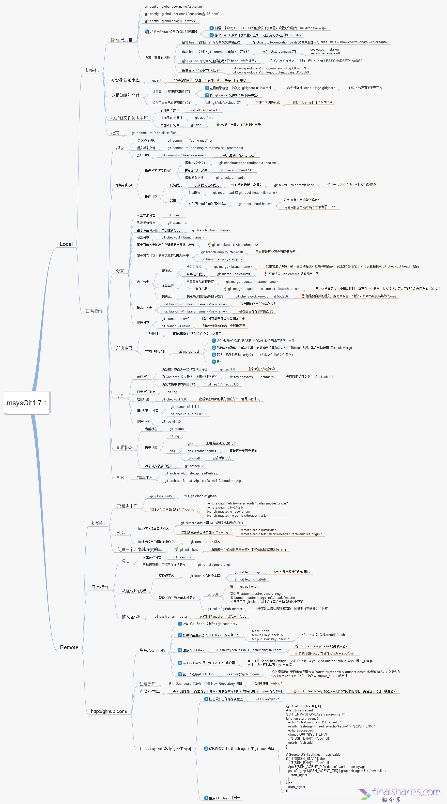
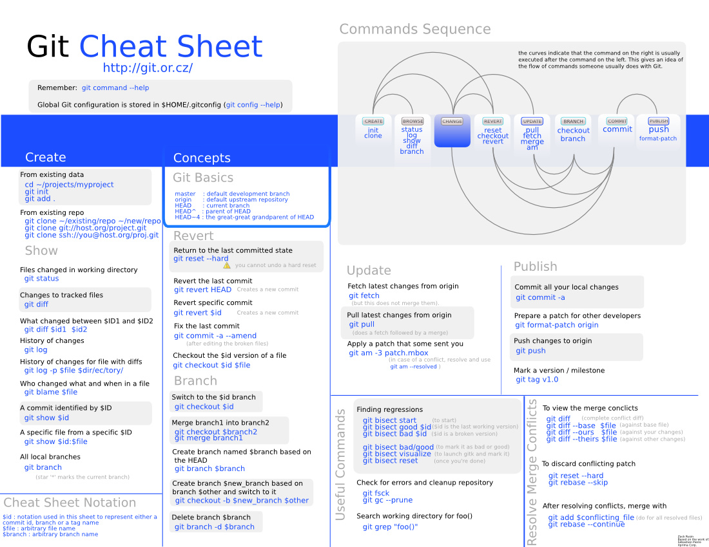

# git 使用心得

[TOC]

## 日常使用

1. 设置用户名、邮箱
    * `git config --global user.name " "`
    * `git config --global user.email " "`
2. 创建版本库
    * `pwd`      # 显示当前目录
    * `git init` # 变成git可以管理的仓库
3. 添加文件到版本库
    * `git add xx.txt`   # 添加到暂存区
    * `git commit`       # 文件提交，把暂存区的内容提交到当前分支
    * `git status`       # 查看是否有未提交文件
    * `git diff  xx.txt` # 查看修改了什么内容
4. 版本回退
    * 查看历史记录
        + `git log`                 # 查看历史记录
        + `git log -pretty=oneline` # (显示缩略信息)
    * `git reflog` #获得版本号
    * `cat xx.txt` #查看内容
    * 版本回退
        + `git reset --hard HEAD^`    # 回退到上个版本
        + `git reset --hard HEAD~100` # 回退到前100个版本
        + `git reset --hard 版本号`    # 通过版本号回退
5. 撤销修改
    * `git checkout -- a.txt` # 丢弃单个文件的修改
    * `git checkout -- .`     # 丢弃全部文件的修改
    * `rm xx.txt`             # 删除文件
6. 工作区
    * 工作区：电脑上能看到的目录
    * 版本库：工作区下的隐藏目录.git，是版本库，存有暂存区、git自动创建的第一个分支master、指向master的一个指针HEAD
7. 分支
    * `git branch`             # 查看本地分支
    * `git branch -a`          # 查看所有分支，包含远程
    * `git branch <name>`      # 创建分支
    * `git checkout <name>`    # 切换分支
    * `git checkout -b <name>` # 创建+切换分支
    * `git merge <name>`       # 合并某分支到当前分支
    * `git branch -d <name>`   # 删除分支
    * `git branch -D <name>`   # 强制删除分支

> 常用的命令

```
git status                 # 查看状态
git add -u                 # 添加跟踪文件
git add -A                 # 使用-A参数会将添加所有改动的已跟踪文件和未跟踪文件。
git commit -m “”           # 提交并注释
git pull 远程分支 本地分支 # 拉取文件（git pull origin 分支 ）
git push origin 分支       # 推送文件到远程分支
git checkout master        # 切换分支
git checkout -b 分支       # 新建分支并切换到
git log                    # 查看历史提交
git reset --hard HEAD^     # 版本回退
git push -f                # 强制推送当前分支到远程，适用于当前版本低于最新提交
```

## 配置

### 配置密钥
> ssh -keygen -t rsa -C < email > # 生成密钥
> ssh -T git@github.com           # 测试是否成功

### 配置个人信息
> git congfig --global user.name < name >
> git config --global user.email < email >

### config
> git config --global user.name < name >                  # 设置提交用户名
> git config --global user.email < email >                # 设置提交邮箱
> git config --list                                       # 查看配置的信息
> git remote remove origin                                # 删除该远程路径
> git remote add origin git@github.com:SeaHai/myNotes.git # 添加远程路径

### help
> git help config #获取帮助信息

### 配置自动换行（自动转换坑太大）
windows 换行符：CRLF 
Linux/UNIX 换行符：LF

* `git config --global core.autocrlf false` # 提交到git是自动将换行符转换为lf (windows 到 UNIX需要转换换行符)
* `git config --global core.autocrlf true`  # 关闭换行转换功能


## 多账号ssh配置

1. 生成指定名字的密钥
    * `ssh-keygen -t rsa -C "邮箱地址" -f ~/.ssh/github_seahai`  #会生成 github_seahai 和 github_seahai.pub 这两个文件
2. 密钥复制到托管平台上
    * `vim ~/.ssh/github_seahai.pub` #打开公钥文件 github_seahai.pub ，并把内容复制至代码托管平台上
3. 修改config文件
> vim ~/.ssh/config #修改config文件，如果没有创建 config
```
Host seahai.github.com
HostName github.com
User git
IdentityFile ~/.ssh/github_seahai
 
Host abc.github.com
HostName github.com
User git
IdentityFile ~/.ssh/github_abc
```
4. 测试
    * `ssh -T git@seahai.github.com` # @后面跟上定义的Host

## 仓库建立方式

### 新建仓库

1. `git init`                                                # 初始化
2. `git status`                                              # 获取状态
3. `git add file`                                            # `.` 或 `*` 代表全部添加
4. `git commit -m "message"`                                 # 添加提交注释
5. `git remote add origin git@github.com:SeaHai/myNotes.git` # 添加远程仓库
6. 推送到远程 
    * `git push -u origin master` # push同时设置默认跟踪分支
    * `git push origin master`    # push到远程
    * `git push -f origin master` # 强制推送

### 从现有仓库克隆

* `git clone git@github.com:SeaHai/myNotes.git`
* `git clone git@github.com:SeaHai/myNotes.git myNotes` #克隆到自定义文件夹

## 命令

### add 添加

* `git add *`         # 跟踪新文件
* `git add -u [path]` # 添加[指定路径下]已跟踪文件

### rm 删除

* `rm *` & `git rm *`          # 移除文件
* `git rm -f *`              # 强制移除文件
* `git rm --cached *`        # 取消跟踪
* `git mv file_from file_to` # 重命名跟踪文件
* `git log`                  # 查看提交记录

### commit 提交

* `git commit`              # 提交更新
* `git commit -m 'message'` # 提交说明
* `git commit -a`           # 跳过使用暂存区域，把所有已经跟踪过的文件暂存起来一并提交
* `git commit --amend`      # 修改最后一次提交

### reset 版本回退

* `git reset HEAD *`         # 取消已经暂存的文件
* `git reset --mixed HEAD *` # 同上
* `git reset --soft HEAD *`  # 重置到指定状态，不会修改索引区和工作树
* `git reset --hard HEAD *`  # 重置到指定状态，会修改索引区和工作树
* `git reset -- files`       # 重置index区文件

### revert 撤销操作

* `git revert HEAD`   # 撤销前一次操作
* `git revert HEAD~`  # 撤销前前一次操作
* `git revert commit` # 撤销指定操作

### checkout

* `git checkout -- file`                        # 取消对文件的修改（从暂存区——覆盖worktree file）
* `git checkout branch|tag|commit -- file_name` # 从仓库取出file覆盖当前分支
* `git checkout -- .`                           # 从暂存区取出文件覆盖工作区

### diff

* `git diff file`            # 查看指定文件的差异
* `git diff --stat`          # 查看简单的diff结果
* `git diff`                 # 比较Worktree和Index之间的差异
* `git diff --cached`        # 比较Index和HEAD之间的差异
* `git diff HEAD`            # 比较Worktree和HEAD之间的差异
* `git diff branch`          # 比较Worktree和branch之间的差异
* `git diff branch1 branch2` # 比较两次分支之间的差异
* `git diff commit commit`   # 比较两次提交之间的差异

### stash

* `git stash`                 # 将工作区现场（已跟踪文件）储藏起来，等以后恢复后继续工作。
* `git stash list`            # 查看保存的工作现场
* `git stash apply`           # 恢复工作现场
* `git stash drop`            # 删除stash内容
* `git stash pop `            # 恢复的同时直接删除stash内容
* `git stash apply stash@{0}` # 恢复指定的工作现场，当你保存了不只一份工作现场时。

## 分支

### branch

* `git branch`                               # 列出本地分支
* `git branch -r`                            # 列出远端分支
* `git branch -a`                            # 列出所有分支
* `git branch -v`                            # 查看各个分支最后一个提交对象的信息
* `git branch --merge`                      # 查看已经合并到当前分支的分支
* `git branch --no-merge`                    # 查看为合并到当前分支的分支
* `git branch test`                          # 新建test分支
* `git branch -m old new`                    # 重命名分支
* `git branch -d test`                       # 删除test分支
* `git branch -D test`                       # 强制删除test分支
* `git branch --set-upstream dev origin/dev` # 将本地dev分支与远程dev分支之间建立链接

### checkout

* `git checkout test`        # 切换到test分支
* `git checkout -b test`     # 新建+切换到test分支
* `git checkout -b test dev` # 基于dev新建test分支，并切换

### merge

* `git merge test`          # 将test分支合并到当前分支
* `git merge --squash test` # 合并压缩，将test上的commit压缩为一条

### cherry-pick

* `git cherry-pick commit`    # 拣选合并，将commit合并到当前分支
* `git cherry-pick -n commit` # 拣选多个提交，合并完后可以继续拣选下一个提交

### rebase

* `git rebase master`              # 将master分支上超前的提交，变基到当前分支
* `git rebase --onto master 169a6` # 限制回滚范围，rebase当前分支从169a6以后的提交
* `git rebase --interactive`       # 交互模式
* `git rebase --continue`          # 处理完冲突继续合并
* `git rebase --skip`              # 跳过
* `git rebase --abort`             # 取消合并

### 远端

* `git fetch origin remotebranch[:localbranch]` # 从远端拉去分支[到本地指定分支]
* `git merge origin/branch`                     # 合并远端上指定分支
* `git pull origin remotebranch:localbranch`    # 拉去远端分支到本地分支
* `git push origin branch`                      # 将当前分支，推送到远端上指定分支
* `git push origin localbranch:remotebranch`    # 推送本地指定分支，到远端上指定分支
* `git push origin :remotebranch`               # 删除远端指定分支
* `git checkout -b [--track] test origin/dev`   # 基于远端dev分支，新建本地test分支[同时设置跟踪]

### 撤销远程记录

* git reset --hard HEAD~1 
* git push -f origin HEAD:master

### 忽略文件

> echo node_modules/ >> .gitignore

### 删除文件

> git rm -rf node_modules/

### 源

> git是一个分布式代码管理工具，所以可以支持多个仓库，在git里，服务器上的仓库在本地称之为remote。 
> 个人开发时，多源用的可能不多，但多源其实非常有用。 

* `git remote add origin1 git@github.com:SeaHai/myNotes.git ` 
* `git remote`                        # 显示全部源
* `git remote -v`                     # 显示全部源+详细信息
* `git remote rename origingit1 origin2` # 重命名
* `git remote rm origin`              # 删除
* `git remote show origin`            # 查看指定源的全部信息

### 标签

> 当开发到一定阶段时，给程序打标签是非常棒的功能。

 
* `git tag`                             # 列出现有标签
* `git tag v0.1`                        # 新建标签
* `git tag -a v0.1 -m 'my version 1.4'` # 新建带注释标签
* `git checkout tagname`                # 切换到标签
* `git push origin v1.5`                # 推送分支到源上
* `git push origin --tags`              # 一次性推送所有分支
* `git tag -d v0.1`                     # 删除标签
* `git push origin :refs/tags/v0.1`     # 删除远程标签

### log

* `git log`                                        # 查看最近的提交日志
* `git log --pretty=oneline`                       # 单行显示提交日志
* `git log --graph --pretty=oneline --abbrev-commit` 
* `git log -num `                                  # 显示第几条log（倒数）
* `git config format.pretty oneline`               # 显示历史记录时，每个提交的信息只显示一行
* `git config color.ui true`                       # 彩色的 git 输出
* `git log --since=1.day`                          # 一天内的提交；你可以给出各种时间格式，比如说具体的某一天（“2008-01-15”），或者是多久以前（“2 years 1 day 3 minutes ago”）。
* `git log --pretty="%h - %s" --author=自己的名字` # 查看自己的日志
* `git log -p -2`                                 # 展开两次更新显示每次提交的内容差异
* `git log --stat`                                 # 要快速浏览其他协作者提交的更新都作了哪些改动
* `git log --pretty=format:"%h - %an, %ar : %s"`   # 定制要显示的记录格式

## 命令速查表






## 参考链接

* [git - 简明指南](http://rogerdudler.github.io/git-guide/index.zh.html)
* [代码合并：Merge、Rebase的选择](https://github.com/geeeeeeeeek/git-recipes/blob/master/sources/%E4%BB%A3%E7%A0%81%E5%90%88%E5%B9%B6Merge%E8%BF%98%E6%98%AFRebase.md)
* [git使用](https://github.com/geeeeeeeeek/git-recipes/tree/master/sources)
* [Git命令详解](http://www.tuicool.com/articles/y6VfQj)
* [Git资源推荐](https://www.zhihu.com/question/38008771/answer/74558769)
* [日常使用 Git 的 19 个建议](http://blog.jobbole.com/96088/)
* [Git 分支模型](http://www.oschina.net/translate/a-successful-git-branching-model)
* [Git分支管理策略](http://www.ruanyifeng.com/blog/2012/07/git.html)

